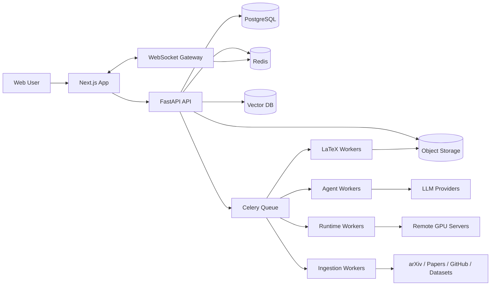
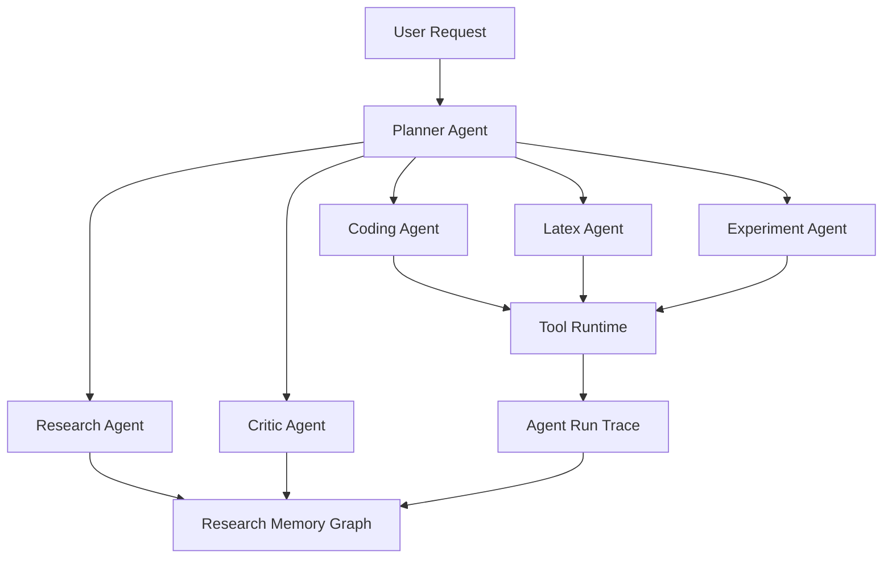

# ResearchOS Architecture

## 1. Architectural Style

ResearchOS should start as a modular monolith plus async workers, with clear service boundaries that can later be extracted. This avoids premature distributed complexity while preserving a production path toward independent scaling of agent execution, remote runtime, LaTeX compilation, experiment ingestion, and marketplace services.

## 2. High-Level Components

## 3. Frontend Architecture

- Next.js App Router for product surfaces and server-side layout composition.
- TypeScript, TailwindCSS, and Shadcn UI for consistent interaction patterns.
- Monaco Editor for code and LaTeX editing.
- TanStack Query or equivalent for server state.
- Zustand or lightweight stores for workspace-local UI state.
- WebSocket client with typed event handlers for chat tokens, job logs, metrics, agent traces, and compile events.
- Feature modules organized by product domain: research, ide, experiments, paper, skills, settings.

## 4. Backend Architecture

- FastAPI application organized by bounded contexts: identity, projects, research, agents, experiments, documents, skills, runtime, billing-ready tenancy.
- PostgreSQL as source of truth for structured data.
- Redis for queue broker, rate limits, ephemeral streaming state, locks, and WebSocket fanout.
- Celery for long-running work and retries.
- Object storage for PDFs, datasets metadata exports, LaTeX artifacts, logs, figures, checkpoints, and generated paper assets.
- Vector database for paper chunks, project notes, code embeddings, agent memories, and skill knowledge.

## 5. AI Agent Architecture

Agents share:

- Project context pack
- User intent and permissions
- Tool registry
- Skill-injected instructions
- Memory read/write interface
- Run trace logger
- Human approval gates for risky actions

## 6. Skills Runtime Architecture

A skill is a package containing:

- Manifest
- Prompt fragments
- Workflow graph
- Tool permissions
- Memory schema
- Agent logic bindings
- Domain knowledge references
- Optional UI/action metadata

Skill execution happens through a policy-controlled runtime. Skills never call tools directly; they request tool access through the platform tool broker, which enforces project permissions, user approvals, sandbox limits, and audit logging.

## 7. Plugin System

Plugins extend tools, connectors, templates, and UI surfaces. The MVP should support internal plugins only. Third-party plugins require signing, review, permission declarations, runtime isolation, compatibility metadata, and revocation.

Plugin categories:

- Literature connectors
- Dataset connectors
- Experiment trackers
- Remote runtimes
- LaTeX templates
- Agent tools
- Skill packs

## 8. Core Data Flow

### Paper Ingestion

1. User searches or imports a paper.
2. Ingestion worker fetches metadata, PDF, and references.
3. PDF is parsed into chunks.
4. Chunks are embedded and indexed.
5. Paper, chunks, citations, and graph edges are stored.
6. WebSocket events notify the UI.

### Remote Experiment

1. User launches a job from project code and runtime profile.
2. Backend creates experiment run and job records.
3. Runtime worker connects to remote server through SSH.
4. Logs and metrics stream through Redis and WebSocket.
5. Artifacts are uploaded to object storage.
6. Experiment Agent summarizes results and creates paper asset candidates.

### LaTeX Compile

1. User edits LaTeX or asks AI to modify a section.
2. Document version is stored.
3. Compile task runs in isolated container.
4. PDF and logs are written to object storage.
5. Compile status and PDF URL are streamed to the UI.

## 9. Event System

Every async operation should emit domain events:

- `agent.run.started`
- `agent.run.token`
- `agent.run.tool_call`
- `agent.run.completed`
- `experiment.run.started`
- `experiment.metric.recorded`
- `experiment.artifact.created`
- `latex.compile.started`
- `latex.compile.failed`
- `memory.edge.created`
- `skill.installed`

Events are persisted for audit where needed and streamed through WebSocket for real-time UI updates.

## 10. Extraction Path

Start with a modular FastAPI backend. Extract services only when operational needs are proven:

- Agent Execution Service when LLM workloads need independent autoscaling.
- Runtime Service when SSH/remote execution needs stronger isolation.
- LaTeX Service when compile throughput or sandboxing becomes specialized.
- Marketplace Service when third-party publishing and review workflows mature.
- Experiment Ingestion Service when high-volume metrics require time-series scaling.
