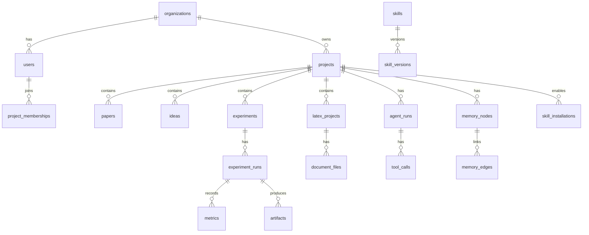

# ResearchOS Database Design

## 1. Storage Choices

- PostgreSQL: source of truth for tenants, projects, papers, experiments, documents, skills, agents, and graph edges.
- Redis: ephemeral state, queues, locks, WebSocket fanout, and rate limits.
- Object storage: PDFs, LaTeX artifacts, figures, logs, checkpoints, datasets metadata exports.
- Vector database: embeddings for paper chunks, project notes, code chunks, memory entries, and skill knowledge.

## 2. Entity Relationship Overview

## 3. Core Tables

### organizations

- `id`
- `name`
- `slug`
- `plan`
- `created_at`
- `updated_at`

### users

- `id`
- `email`
- `display_name`
- `avatar_url`
- `created_at`
- `updated_at`

### project_memberships

- `id`
- `project_id`
- `user_id`
- `role`
- `created_at`

### projects

- `id`
- `organization_id`
- `name`
- `description`
- `field`
- `status`
- `settings_json`
- `created_by`
- `created_at`
- `updated_at`

## 4. Research Tables

### papers

- `id`
- `project_id`
- `title`
- `abstract`
- `authors_json`
- `venue`
- `published_at`
- `external_ids_json`
- `pdf_url`
- `pdf_object_key`
- `source`
- `summary`
- `metadata_json`

### paper_chunks

- `id`
- `paper_id`
- `chunk_index`
- `section`
- `text`
- `embedding_id`

### ideas

- `id`
- `project_id`
- `title`
- `description`
- `hypothesis`
- `status`
- `novelty_score`
- `created_by`

### research_critiques

- `id`
- `project_id`
- `idea_id`
- `agent_run_id`
- `novelty_summary`
- `weaknesses_json`
- `missing_baselines_json`
- `dataset_risks_json`
- `reproducibility_json`

## 5. Experiment Tables

### experiments

- `id`
- `project_id`
- `name`
- `description`
- `goal`
- `default_config_json`
- `created_by`

### experiment_runs

- `id`
- `experiment_id`
- `project_id`
- `name`
- `status`
- `git_commit`
- `config_json`
- `runtime_profile_id`
- `started_at`
- `finished_at`
- `created_by`

### metrics

- `id`
- `run_id`
- `name`
- `step`
- `value`
- `timestamp`

### artifacts

- `id`
- `run_id`
- `artifact_type`
- `name`
- `object_key`
- `metadata_json`
- `created_at`

## 6. Documents Tables

### latex_projects

- `id`
- `project_id`
- `name`
- `main_file_path`
- `template_id`
- `created_by`

### document_files

- `id`
- `latex_project_id`
- `path`
- `content`
- `version`
- `updated_by`
- `updated_at`

### latex_compile_jobs

- `id`
- `latex_project_id`
- `status`
- `pdf_object_key`
- `log_object_key`
- `error_summary`
- `created_by`
- `created_at`
- `finished_at`

## 7. Agent and Memory Tables

### agent_runs

- `id`
- `project_id`
- `user_id`
- `agent_type`
- `status`
- `input_json`
- `output_json`
- `skill_ids_json`
- `token_usage_json`
- `cost_json`
- `started_at`
- `finished_at`

### tool_calls

- `id`
- `agent_run_id`
- `tool_name`
- `arguments_json`
- `result_json`
- `status`
- `started_at`
- `finished_at`

### memory_nodes

- `id`
- `project_id`
- `node_type`
- `title`
- `content`
- `source_table`
- `source_id`
- `embedding_id`
- `metadata_json`

### memory_edges

- `id`
- `project_id`
- `from_node_id`
- `to_node_id`
- `edge_type`
- `weight`
- `metadata_json`

## 8. Skills Tables

### skills

- `id`
- `slug`
- `name`
- `author`
- `visibility`
- `status`
- `created_at`

### skill_versions

- `id`
- `skill_id`
- `version`
- `manifest_json`
- `package_object_key`
- `checksum`
- `published_at`

### skill_installations

- `id`
- `organization_id`
- `project_id`
- `skill_version_id`
- `enabled`
- `settings_json`
- `installed_by`
- `installed_at`

## 9. Vector Storage

Vector collections:

- `paper_chunks`
- `project_notes`
- `code_chunks`
- `agent_memories`
- `skill_knowledge`

Each vector record should store:

- `tenant_id`
- `project_id`
- `source_type`
- `source_id`
- `chunk_id`
- `embedding_model`
- `metadata`

## 10. Indexing Guidelines

- Index all foreign keys.
- Composite indexes for `project_id + created_at`.
- Composite indexes for experiment metrics: `run_id + name + step`.
- Unique constraints for skill slug/version.
- Use JSONB for flexible metadata, but avoid hiding core query fields in JSONB.
