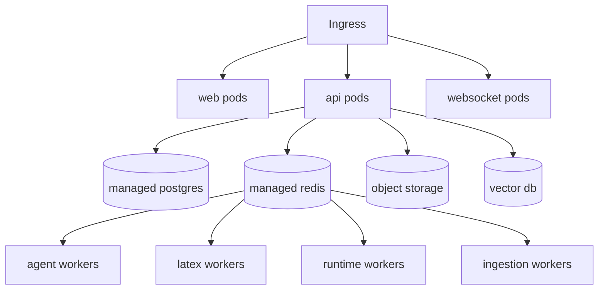

# ResearchOS Deployment

## 1. Environments

- Local development
- Preview/staging
- Production

Each environment should have isolated databases, object storage buckets, Redis instances, queues, and LLM provider credentials.

## 2. Docker Compose for Development

Services:

- web
- api
- worker-agent
- worker-runtime
- worker-latex
- worker-ingestion
- postgres
- redis
- object-storage
- vector-db

## 3. Production Components

- Next.js web deployment
- FastAPI API deployment
- WebSocket gateway deployment
- Celery worker deployments by queue
- PostgreSQL managed database
- Redis managed service
- Object storage
- Vector database
- Secret manager
- Observability stack

## 4. Kubernetes Topology

## 5. Scaling

Scale independently:

- API by request traffic.
- WebSocket gateway by active connections.
- Agent workers by LLM queue depth.
- Runtime workers by active remote sessions.
- LaTeX workers by compile queue depth.
- Ingestion workers by paper/PDF queue depth.

## 6. Secrets

Store in managed secret system:

- Database credentials
- Redis credentials
- Object storage keys
- LLM provider keys
- SSH key encryption keys
- OAuth client secrets

Secrets must not be baked into images.

## 7. CI/CD

Pipeline:

1. Lint and typecheck frontend.
2. Lint and typecheck backend.
3. Run unit tests.
4. Run API contract tests.
5. Build Docker images.
6. Run migrations in staging.
7. Deploy staging.
8. Run smoke tests.
9. Promote to production.

## 8. Backups and Recovery

- Daily PostgreSQL backups with point-in-time recovery.
- Object storage lifecycle and versioning for critical artifacts.
- Redis treated as ephemeral except queues; design jobs to recover from persisted task records.
- Exportable project archives for user data portability.

## 9. Observability

Metrics:

- Request latency
- Error rates
- Queue depth
- Worker duration
- WebSocket connection count
- LLM token/cost usage
- Compile failure rate
- Runtime command failure rate

Logs:

- Structured JSON logs with request IDs, task IDs, project IDs, and user IDs where safe.

Tracing:

- Distributed traces for API -> queue -> worker -> provider flows.
