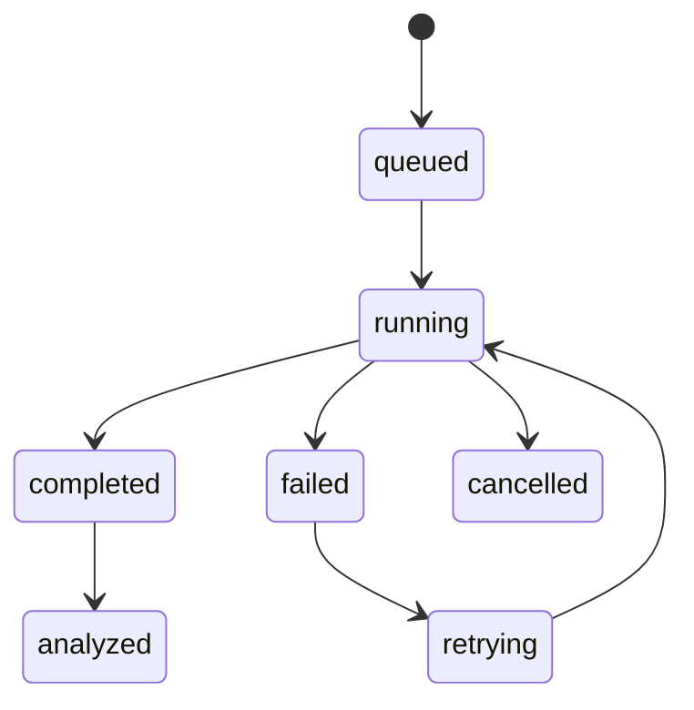

# ResearchOS Experiment System

## 1. Purpose

The experiment system tracks machine learning experiments from launch to analysis and connects results to research ideas, code, artifacts, and paper sections.

## 2. Concepts

- Experiment: a research question or training/evaluation setup.
- Run: one execution with config, code version, metrics, logs, and artifacts.
- Metric: scalar or structured measurement over time.
- Artifact: file produced by a run.
- Comparison: selected runs evaluated side by side.
- Paper asset: table, figure, caption, or text generated from a run.

## 3. Run Lifecycle

## 4. Run Metadata

Each run stores:

- Project and experiment IDs
- Name and description
- Git commit and branch
- Config JSON
- Runtime profile
- Command
- Dataset references
- Baseline references
- Start/end timestamps
- Status
- Created by

## 5. Metrics

MVP metric ingestion:

- JSONL files emitted by training scripts
- stdout parsing
- TensorBoard scalar export
- manual upload

Metric model:

- `run_id`
- `name`
- `step`
- `value`
- `timestamp`
- `metadata`

## 6. Artifacts

Supported artifacts:

- Logs
- Checkpoints
- Generated figures
- Tables
- Config snapshots
- Evaluation reports
- Dataset manifests

Artifacts are stored in object storage and indexed in PostgreSQL.

## 7. Comparison View

Comparison should support:

- Multiple selected runs
- Metric overlays
- Final metric table
- Config diff
- Artifact diff
- Agent-generated result interpretation
- Export to LaTeX table

## 8. Experiment Agent

The Experiment Agent can:

- Explain run failures.
- Summarize best/worst runs.
- Detect unstable training.
- Recommend next experiments.
- Generate paper-ready table data.
- Draft captions and result summaries.

It must distinguish observed results from speculation.

## 9. Reproducibility Checklist

For each important run, store:

- Code version
- Config
- Dataset version
- Random seed
- Environment
- Hardware
- Command
- Logs
- Artifacts

## 10. Future Extensions

- Weights & Biases import
- MLflow import
- Hyperparameter sweeps
- Slurm/Ray/Kubernetes execution
- Dataset lineage
- Automatic benchmark reports
- Lab-level experiment templates
